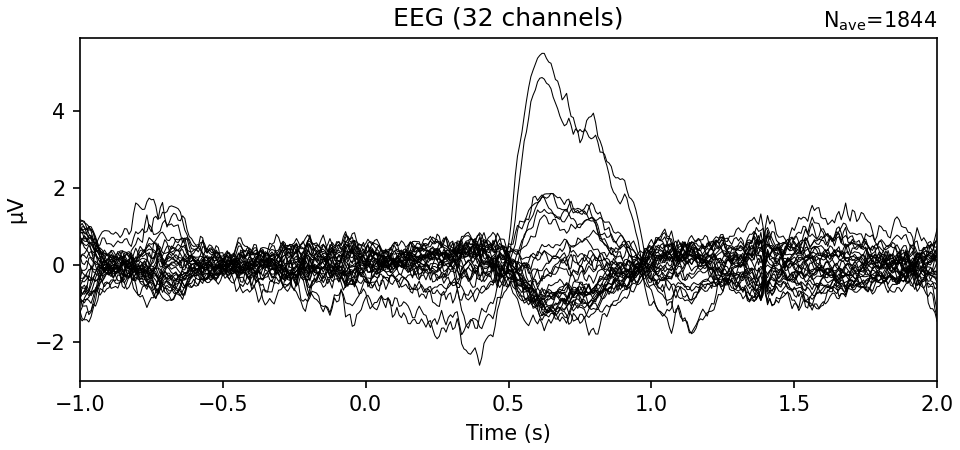
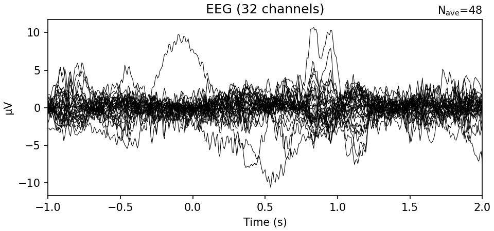
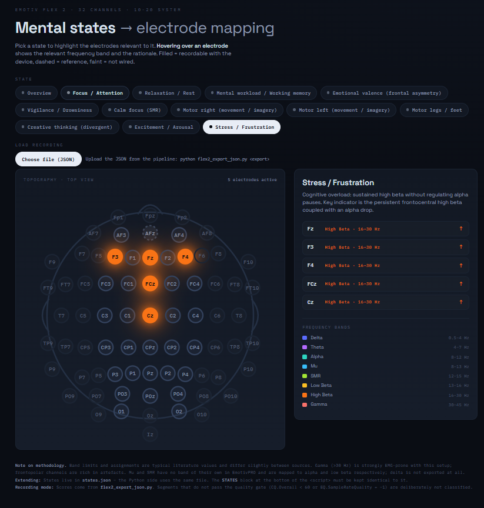

# Gruppe 5 – EEG Abschlussdokumentation

**Seminar:** Multilingual AI · SoSe 2026  
**Gruppe 5:** Maximilian Englisch, Grischa Staar, Lawan Mai, Jinghao Zhang  
**Betreuung / Feedback:** Bagci, Baumartz  

Dieses Repository und diese `README.md` bilden die **Abschlussdokumentation** unseres EEG-Projekts. Enthalten sind EEG-Grundlagen, Recherche, Datensatzbewertung, Preprocessing-Entscheidungen, Pipeline-Prototypen auf Basis des Hand-Gesture-Datensatzes (Emotiv Flex 2), synthetische Emotion-/Kognitionsdaten sowie zwei Visualisierungslinien (Zustands-Playback und MRCP-/Dataset-Reports).

**Aufbau der Doku:** Diese Datei fasst Aufgabe, Team, Forschung und Ergebnisse zusammen. Pro Projektordner gibt es eine **Modul-README** mit Installation, Dateien und Bedienung – unten im Index verlinkt.

### Dokumentationsindex (Modul-READMEs)

| Modul | README | Inhalt |
| --- | --- | --- |
| [`presentations/`](presentations/) | [`presentations/README.md`](presentations/README.md) | Präsentationen, Pipeline-PDF, Klassifizierung Excel |
| [`pipeline_prototype/`](pipeline_prototype/) | [`pipeline_prototype/README.md`](pipeline_prototype/README.md) | Früher MNE-Prototyp (CSV → Filter → Epochs → Plots) |
| [`legacy_synthetic_exports/`](legacy_synthetic_exports/) | [`legacy_synthetic_exports/README.md`](legacy_synthetic_exports/README.md) | Synthetische Emotion-Zustände, Legacy-HTML-Demo |
| [`synthetic_emotivexport/`](synthetic_emotivexport/) | [`synthetic_emotivexport/README.md`](synthetic_emotivexport/README.md) | EmotivPRO-V2-Dummy, Schema, MNE-Import, Error Cases |
| [`eeg-state-visualizer/`](eeg-state-visualizer/) | [`eeg-state-visualizer/README.md`](eeg-state-visualizer/README.md) | Flex-2-Export → JSON → abspielbare Zustands-Topografie |
| [`mrcp-eeg-analysis/`](mrcp-eeg-analysis/) | [`mrcp-eeg-analysis/README.md`](mrcp-eeg-analysis/README.md) | MRCP-Pipeline, HTML-Reports, Gruppenanalyse, Videos |

Begleitende Materialien unter [`presentations/`](presentations/) (Übersicht: [`presentations/README.md`](presentations/README.md)):

- [`presentations/EEG_AbschlussPräsi.pptx`](presentations/EEG_AbschlussPräsi.pptx) – Abschlusspräsentation  
- [`presentations/Gruppe5_EEG_Präsi.pptx`](presentations/Gruppe5_EEG_Präsi.pptx) – Zwischenpräsentation  
- [`presentations/EEG-Preprocessing-Pipeline.pdf`](presentations/EEG-Preprocessing-Pipeline.pdf) – Pipeline-Überblick  
- [`presentations/klassifizierung.xlsx`](presentations/klassifizierung.xlsx) – Zuordnung mentale Zustände ↔ Elektroden ↔ Frequenzbänder  

---

## 1. Aufgabenbeschreibung

Unsere Ausgangsaufgabe war, **öffentliche EEG-Datensätze** zu finden und zu bewerten, die zum Gerät passen, das an unserer Uni bestellt und geliefert werden sollte: dem **Emotiv Flex 2** (32 Kanäle, Consumer-/Research-taugliches Headset).

Daraus ergaben sich konkrete Teilziele:

1. **Recherche** möglichst vieler Open-Source-/öffentlich verfügbarer EEG-Datensätze (Schwerpunkte u. a. Motorik, Kognition, Emotion, Lernen).  
2. **Filterung** nach Hardware-Nähe (idealerweise Emotiv Flex 2 oder vergleichbare Emotiv-Geräte), Labelqualität, Dokumentation und Nutzbarkeit in Python.  
3. **Auswahl** eines geeigneten Datensatzes als Einstieg für Preprocessing, Visualisierung und Experimente.  
4. **Recherche und Vergleich** gängiger EEG-Preprocessing-Pipelines / Libraries.  
5. **Aufbau eines Pipeline-Prototyps** (CSV → MNE → Filter / Referenz / Epoching → erste Plots).  
6. Nach Feedback: stärkerer Fokus auf **Kreativität, Emotion und Kognition** – u. a. durch **synthetische Datensätze**, weil reale Emotion-Tasks mit Flex-2-Hardware öffentlich kaum verfügbar waren.  
7. **Visualisierungen** (HTML-Demo, Dataset-Visualisierung) und Abschlusspräsentation.

Da das physische Gerät anfangs noch nicht zuverlässig für eigene Aufnahmen zur Verfügung stand, war der Pfad über **öffentliche + synthetische Daten** der pragmatische Weg, trotzdem Pipeline, Demo und Visualisierung voranzutreiben.

---

## 2. Team und Aufteilung

Grundprinzip: **Alle haben an allem mitgearbeitet** – Datensätze suchen, Pipelines ausarbeiten, Tests schreiben, Visualisierungen anfassen. Gegen Ende haben wir Schwerpunkte geschärft:

| Person | Schwerpunkt | Mitwirkung darüber hinaus |
| --- | --- | --- |
| **Max** | Datensatz-Recherche, Pipeline-Vergleich, MNE/PyPREP-Entscheidung, Pipeline-Prototyp, Abschlussdoku | Synthetische Daten, Visualisierungen, Tests |
| **Grischa** | Synthetische Emotion-/Kognitionsdaten, EmotivPRO-Export-Dummy, Mapping mentale Zustände ↔ Bänder/Elektroden | Dataset-Recherche, Pipeline, HTML-Anbindung |
| **Lawan** | EEG-Zustands-Visualisierung / interaktive Zustandsdarstellung (Hauptfokus) | Research, Feedback-Einbau, Klassifikation |
| **Jinghao** | Dataset-Visualisierung (Hauptfokus) | Research, Pipeline-Tests, gemeinsame Demos |

Die Visualisierungsmodule sind in **Kapitel 7** (Zustands-Playback, Lawan) und **Kapitel 8** (MRCP-/Dataset-Analyse, Jinghao) beschrieben; technische Details stehen in den jeweiligen Modul-READMEs (siehe Index oben).

---

## 3. EEG-Grundlagen

Damit die Datensatzwahl, die Pipeline und die Visualisierungen nachvollziehbar sind, hier kurz die fachlichen Basics, auf die wir uns im Projekt gestützt haben. Die Zuordnung **mentaler Zustand ↔ Elektroden ↔ Frequenzband** haben wir in [`presentations/klassifizierung.xlsx`](presentations/klassifizierung.xlsx) festgehalten und unten übernommen.

### 3.1 Was ist EEG?

**Elektroenzephalografie (EEG)** misst die elektrische Aktivität der Großhirnrinde über Elektroden auf der Kopfhaut. Viele Neurone feuern synchron – die Summenspannung (typisch im Mikrovolt-Bereich) wird zeitlich hochaufgelöst abgetastet.

Für uns relevante Eigenschaften:

- **Nicht-invasiv** und relativ günstig (besonders mit Consumer-Headsets wie dem Emotiv Flex 2)  
- **Hohe zeitliche Auflösung** (bei uns oft **128 Hz**) – gut für Events, Epoching und schnelle Zustandswechsel  
- **Begrenzte räumliche Auflösung** – man sieht eher regionale Muster als millimetergenaue Quellen  
- Das Rohsignal ist **rauschig** (Netzbrumm, Augen-/Muskelartefakte, schlechter Kontakt) → Preprocessing ist Pflicht  

EEG eignet sich damit gut für **Brain-Computer-Interfaces**, Aufmerksamkeits-/Emotionsdemos und Motor-Tasks – genau die Richtung unseres Seminarthemas.

### 3.2 Gehirnwellen (Frequenzbänder)

Statt nur die Rohkurve zu betrachten, zerlegt man EEG oft in **Frequenzbänder**. Unterschiedliche Bänder hängen typischerweise mit unterschiedlichen mentalen Zuständen zusammen (vereinfacht, nicht diagnostisch):

| Band | Ungefährer Bereich | Typische Assoziation |
| --- | --- | --- |
| **Delta** | ~0,5–4 Hz | tiefer Schlaf, sehr langsame Aktivität |
| **Theta** | ~4–8 Hz | Dösen, innere Verarbeitung; frontal-mittig oft mit **Fokus / Workload** verknüpft |
| **Alpha** | ~8–13 Hz | entspannte Wachheit, Augen zu (stark okzipital); auch bei **Kreativität** und als Basis für **Emotions-Asymmetrie** |
| **Mu** | ~8–13 Hz (über sensomotorischem Kortex) | Ruhe im motorischen System; **sinkt** bei Bewegung oder Bewegungsvorstellung |
| **SMR / Low Beta** | ~12–16 Hz | ruhige Aufmerksamkeit / kontrolliertes Engagement |
| **Beta** (inkl. High Beta) | ~13–30 Hz | aktive Konzentration, Anspannung; stark erhöht oft mit **Stress / Arousal** assoziiert |
| **Gamma** | ~30–45+ Hz | schnelle Bindung / hohe kognitive Aktivität; artefaktanfällig |

In EmotivPRO-Exports erscheinen Bandpower oft als `POW.<Sensor>.<Theta|Alpha|BetaL|BetaH|Gamma>` – genau dieses Schema nutzen wir im Dummy unter `synthetic_emotivexport/`.

### 3.3 Elektrodenplatzierung (10-10 / 10-20)

Elektroden werden nach dem internationalen **10-20-** bzw. feineren **10-10-System** benannt. Die Buchstaben stehen für Hirnregionen, die Zahlen für die Seite:

| Buchstabe | Region | Grobe Funktion |
| --- | --- | --- |
| **Fp / AF** | Frontopolar / Anterior-Frontal | Aufmerksamkeit, Emotion, Annäherung/Vermeidung |
| **F** | Frontal | Planung, Logik, Emotion, Kreativität |
| **FC / C / CP** | Frontozentral / Zentral / Centroparietal | Motorik, Sensorimotorik (Mu/Beta) |
| **P / PO** | Parietal / Parieto-okzipital | Integration, Ruhe-/Alpha-Aktivität |
| **O** | Okzipital | Visuelles System, Alpha bei Augen zu |
| **T** | Temporal | auditorisch / sprachbezogen (bei unserem 32er-Layout weniger zentral) |

**Seitenkodierung:** ungerade = links (z. B. **C3**), gerade = rechts (z. B. **C4**), **z** = Mittellinie (z. B. **Cz**, **Fz**).  
Wichtig für Motorik: der **linke** Motorkortex steuert die **rechte** Körperseite → rechte Handbewegung zeigt sich vor allem um **C3**.

Unser Emotiv-Flex-2-Layout (32 Kanäle) entspricht grob:

`AF3, AF4, F3, F1, Fz, F2, F4, FC3, FC1, FCz, FC2, FC4, C3, C1, Cz, C2, C4, CP3, CP1, CPz, CP2, CP4, P3, P1, Pz, P2, P4, PO3, POz, PO4, O1, O2`

(siehe auch [`synthetic_emotivexport/epocflex_channel_mapping_dummy.json`](synthetic_emotivexport/epocflex_channel_mapping_dummy.json)).

### 3.4 Welche Bereiche sind wofür relevant?

Aus unserer Klassifizierungsübersicht ([`klassifizierung.xlsx`](presentations/klassifizierung.xlsx)):

| Mentaler Zustand | Relevante Elektroden | Frequenzband | Signal und Bedeutung |
| --- | --- | --- | --- |
| **Motorik rechts** (Bewegung/Vorstellung) | **C3** (Fokus), FC3, CP3 | Mu (8–13 Hz), Beta (13–30 Hz) | Sinkt während Bewegung/Vorstellung; steigt (Rebound) direkt nach Stopp |
| **Motorik links** (Bewegung/Vorstellung) | **C4** (Fokus), FC4, CP4 | Mu, Beta | analog zur rechten Seite, kontralateral |
| **Motorik Beine** | Cz, FCz, CPz | Mu (8–13 Hz) | Sinkt bei Bewegung der unteren Extremitäten |
| **Visuelles & Entspannung** (Augen zu) | **O1, O2** (Fokus), PO3, POz, PO4 | Alpha (8–13 Hz) | Schießt hoch bei Augen zu, fällt sofort bei Augen auf |
| **Logik, Fokus & Workload** (Kopfrechnen, Rätsel) | **Fz** (Fokus), F1, F2, F3, F4 | Theta (4–8 Hz), Beta (13–30 Hz), Alpha (8–13 Hz) | Theta steigt stark an der Mittellinie (Fz); Beta steigt global; Alpha sinkt (Alpha-Blockade) |
| **Emotionen & Stress** (negativ / Vermeidung) | AF3, F3 (links), AF4, F4 (rechts) | Alpha (8–13 Hz) | Asymmetrie: Alpha links höher → rechte Hemisphäre aktiver → Stress/Vermeidung |
| **Emotionen & Entspannung** (positiv / Annäherung) | AF3, F3 (links), AF4, F4 (rechts) | Alpha (8–13 Hz) | Asymmetrie: Alpha rechts höher → linke Hemisphäre aktiver → positiv/Annäherung |
| **Kreatives Denken** (Out-of-the-Box) | F-Reihe (F3, F4, Fz), P-Reihe (P3, P4, Pz) | Alpha (8–13 Hz) | Alpha steigt (Gehirn blockt externe Reize, um intern ungestört Ideen zu generieren) |

Diese Zuordnung erklärt auch unsere Projektentscheidungen:

- Beim **Hand-Gesture-Datensatz** schauen wir vor allem auf **C3 / frontozentrale** Kanäle und Mu/Beta (Motorik rechts).  
- Bei den **synthetischen Emotion-/Kognitionsdaten** modellieren wir u. a. frontale Alpha-Asymmetrie, Frontal-Midline-Theta (Fokus) und okzipitales Alpha (Entspannung) – passend zu den Zeilen oben.  
- Der **EEG State Visualizer** ([`eeg-state-visualizer/`](eeg-state-visualizer/)) setzt diese Zuordnung für die synthethischen Emotion-/Kognitionsdaten um: Die Zustände mit ihren Elektroden, Bändern und Trends sind in [`states.json`](eeg-state-visualizer/states.json) definiert, die Oberfläche färbt die Elektroden je Zustand ein.

### 3.5 Kurz: von der Kurve zur Aussage

```text
Roh-EEG (viele Kanäle, Zeit)
        ↓  Filter / Referenz / ggf. Bad Channels
Vorverarbeitetes Signal
        ↓  Epoching um Events  ODER  Bandpower über Zeitfenster
ERP / spektrale Features pro Region
        ↓
Interpretation entlang Zustands-Tabelle (Motorik, Fokus, Emotion, …)
        ↓
Pipeline-Plots  bzw.  HTML-/Dataset-Visualisierung
```

---

## 4. Recherche: öffentliche EEG-Datensätze

### 4.1 Ausgangspunkt und Kriterien

Als Einstieg diente die kuratierte Liste öffentlicher EEG-Datensätze:

- **[meagmohit/EEG-Datasets](https://github.com/meagmohit/EEG-Datasets)** – Überblick über **100+** öffentliche EEG-Sets (Motorik, Kognition, Emotion, Schlaf, BCI, …).

Darauf aufbauend haben wir Datensätze grob nach Domänen sortiert (siehe auch Zwischenpräsentation) und mit folgenden Kriterien bewertet:

| Kriterium | Warum relevant für uns |
| --- | --- |
| **Gerät / Kanalzahl** | Möglichst Emotiv Flex 2 (32 Kanäle, ~128 Hz) oder zumindest Emotiv-Familie |
| **Task / Labels** | Klare Events/Marker für Epoching und Visualisierung |
| **Dokumentation** | Montage, Sampling, Protokoll, Dateiformat nachvollziehbar |
| **Nutzbarkeit in MNE** | CSV/EDF o. Ä. → RawArray / Raw, Events, Epochs |
| **Größe & Aufwand** | Für Seminar-Prototyp handhabbar (nicht nur „Million-Trial Deep Learning“) |
| **Passung zum Seminarfokus** | Idealerweise Emotion/Kognition/Kreativität – real selten mit Flex 2 |

### 4.2 Übersicht der genauer betrachteten Datensätze

| Datensatz | Gerät | Task | Für uns nutzbar? | Kurzfazit |
| --- | --- | --- | --- | --- |
| **Hand Gesture (MRCP)** | Emotiv Flex 2, 32 Ch, 128 Hz | Willentliche rechte Handbewegung (Faustschluss) + EMG | **Ja – Hauptdatensatz** | Hardware passt 1:1; ideal zum Testen der Preprocessing-Pipeline |
| **Alljoined-1.6M** | Emotiv Flex 2 (Epoc Flex 2 Gel) | ~1,6 Mio. visuelle Trials / EEG→Image | Eingeschränkt | Gerät passt, aber Scale & Fokus (Deep Decoding) zu groß für unseren Seminar-Prototyp |
| **Kaggle Distance Learning** | Emotiv Epoc X (14 Kanäle) | Online-Vorlesung, Verständnis ja/nein | Nur bedingt | Emotiv-Familie & kognitiver Task, aber anderes Gerät / 14 statt 32 Kanäle |
| Weitere Sets aus EEG-Datasets | diverse Lab-Systeme | Motor Imagery, Emotion (DEAP etc.), P300, … | Meist nein als Hauptset | Oft Research-Grade-Hardware, anderer Formfaktor, wenig Flex-2-Bezug |

### 4.3 Hand Gesture Dataset (gewählt)

**Quellen**

- Paper / Data in Brief: [ScienceDirect – EEG and EMG Dataset for Analyzing Movement-Related Cortical Potentials in Hand Gesture Tasks](https://www.sciencedirect.com/science/article/pii/S2352340926001496)  
- Download: [Mendeley Data – y23s2xg6x4](https://data.mendeley.com/datasets/y23s2xg6x4/1)

**Inhalt (kurz)**

- Aufgabe: **willentliche rechte Handbewegung** (Faustschluss) zur Analyse von **Movement-Related Cortical Potentials (MRCPs)**  
- EEG: **32 Elektroden** nach **10-10-System**, Fokus fronto-zentral (u. a. FC3, FC1, FCz, C3, C1, Cz, CP3, CP1, CPz)  
- Sampling: **128 Hz**  
- Parallel **EMG** am rechten Unterarm zur Validierung der Bewegung  
- Format bei uns im Repo: CSV-Dateien pro Subject/Trial (`SUBJECT##_Trial_##_EEG.csv` / `_EMG.csv`), Spalten u. a. `Triggers` + nummerierte EEG-Kanäle `2`–`33`

**Warum wir ihn genommen haben**

1. **Genau unser Gerät** (Emotiv Flex 2) – gleiche Kanalzahl und Sampling-Rate wie erwartet.  
2. **Klare Trigger/Events** → Epoching und Averaging in MNE sind unmittelbar möglich.  
3. **Handhabbare Größe** für Notebooks und einen ersten Pipeline-Durchlauf.  
4. Guter Einstieg für **Preprocessing, Visualisierung und dynamische Darstellung**, auch wenn der Task (Motorik) thematisch nicht 1:1 Emotion/Kreativität ist.

**Einschränkung**

Der Task ist motorisch, nicht emotional. Für den späteren Seminarfokus (Emotion / Kreativität / Kognition) reicht er als **technisches Fundament**, nicht als inhaltliche Endlösung – daher später synthetische Emotion-Zustände.

Im Repository liegen Rohdaten und erste Pipeline-Outputs unter:

- Rohdaten (Auszug): [`pipeline_prototype/data/raw/`](pipeline_prototype/data/raw/)  
- Pipeline-Code: [`pipeline_prototype/src/eeg_pipeline.py`](pipeline_prototype/src/eeg_pipeline.py)  
- Beispiel-Plots: [`pipeline_prototype/outputs/figures/`](pipeline_prototype/outputs/figures/)

Beispiel Averaged Evoked Response (Event `7711`) über Subjects:



Subject 01, gleiches Event:



### 4.4 Alljoined-1.6M

**Quellen**

- Paper: [Alljoined-1.6M (arXiv)](https://arxiv.org/html/2508.18571v2)  
- Dataset u. a. auf Hugging Face / NEMAR (siehe Paper)

**Inhalt (kurz)**

- > **1,6 Millionen** visuelle Stimulus-Trials von **20 Personen**  
- Aufgenommen mit **consumer-grade 32-Kanal-System** (Emotiv Flex 2 / Epoc Flex 2 Gel, ~2,2k USD)  
- Ziel: prüfen, ob **semantisches Decoding / EEG-to-Image** auch mit günstiger Hardware skaliert  

**Warum interessant**

- Direkt **Flex-2-Hardware** und großer, aktueller Open-Source-Datensatz  
- Zeigt, dass Consumer-EEG für moderne BCI-/ML-Fragen relevant ist  

**Warum nicht unser Hauptdatensatz**

- Für Seminar-Prototyp und HTML-Demo **zu groß** (Storage, Preprocessing, Fokus Deep Learning)  
- Task ist visuelle Semantik / Image Reconstruction – passt weniger zu unserer Demo-Richtung Emotion/Kreativität  
- Lizenz / Downstream-Nutzung ggf. restriktiver (u. a. CC-BY-NC-ND auf NEMAR-Seite erwähnt)

Alljoined blieb damit eine **wichtige Referenz** („es gibt große Flex-2-Daten“), nicht der Arbeitsdatensatz.

### 4.5 Kaggle: EEG Distance Learning (Emotiv Epoc X)

**Quelle:** [Kaggle – EEG data / Distance learning](https://www.kaggle.com/datasets/madyanomar/eeg-data-distance-learning-environment)

**Inhalt (kurz)**

- Emotiv **Epoc X, 14 Kanäle**  
- Studierende schauen Online-Vorlesungen; Label: Vorlesung verstanden (1) / nicht verstanden (0)  
- Roh-EEG + Bandpower-Features pro Sensor  

**Warum interessant**

- Emotiv-Ökosystem, **kognitiver / Lern-Kontext** (näher an Seminar-Themen als reine Motorik)  
- Einfach als CSV auf Kaggle verfügbar  

**Warum nicht Hauptdatensatz**

- **Anderes Gerät** (14 statt 32 Kanäle, anderes Montage-Layout)  
- Pipeline und Visualisierung wären nicht 1:1 auf Flex 2 übertragbar  
- Labelqualität (self-report / Verständnis) ist grob und experimentell anders aufgebaut  

### 4.6 Zwischenfazit Datensätze

| Priorität | Datensatz | Rolle im Projekt |
| --- | --- | --- |
| 1 | Hand Gesture (Flex 2) | Pipeline, Epoching, erste Plots, technische Basis |
| 2 | Synthetische Emotion-Daten (selbst erzeugt) | Demo Emotion/Kognition nach Feedback |
| Referenz | Alljoined-1.6M | Hardware-Validierung „Flex 2 in der Wildbahn“ |
| Kontext | Kaggle Epoc X | Kognition/Lernen, aber Hardware-Mismatch |

---

## 5. Recherche: Preprocessing-Pipelines und Libraries

### 5.1 Warum Preprocessing überhaupt?

EEG ist rauschig: Elektrodenkontakt, Netzbrumm (50/60 Hz), Augen-/Muskelartefakte, Drift. Ohne systematische Vorverarbeitung sind Filterung, Epoching und Visualisierung unzuverlässig. Ein guter Überblick aus Emotiv-Sicht:

- [Emotiv – EEG Preprocessing Pipeline Guide](https://www.emotiv.com/de/blogs/news/eeg-preprocessing-pipeline-guide)

Typische Schritte (je nach Pipeline leicht unterschiedlich): Bad-Channel-Detection, Filterung, Re-Referenzierung, Artefaktbehandlung (z. B. ICA), Epoching, Baseline-Korrektur.

### 5.2 Betrachtete Optionen

| Option | Link(s) | Stack | Kurzbeschreibung | Bewertung für uns |
| --- | --- | --- | --- | --- |
| **PREP (klassisch)** | [PubMed / Bigdely-Shamlo et al.](https://pubmed.ncbi.nlm.nih.gov/26150785/) | oft MATLAB/EEGLAB-Kontext | Standardisierte Pipeline: robuste Referenz, Bad Channels, … | Konzeptuell stark; wir brauchen Python |
| **PyPREP** | [GitHub sappelhoff/pyprep](https://github.com/sappelhoff/pyprep), [Zenodo](https://zenodo.org/records/18788268) | Python | Python-Implementierung der PREP-Pipeline | Gut als **Erweiterung** für Bad Channels / robuste Referenz |
| **EEGprep** | [GitHub sccn/eegprep](https://github.com/sccn/eegprep) | Python (EEGLAB-Nähe) | „EEGLAB for Python“ | Interessant, aber für uns weniger zentral als MNE |
| **MNE-Python** | [mne.tools](https://mne.tools/stable/index.html), [Tutorial Overview](https://mne.tools/stable/auto_tutorials/intro/10_overview.html) | Python | Framework für Laden, Filtern, Events, Epochs, Plotting, ICA, … | **Hauptbasis** |
| **EEG-Pype** | [PMC](https://pmc.ncbi.nlm.nih.gov/articles/PMC12970966/), [GitHub](https://github.com/yorbenlodema/EEG-Pype) | MNE + GUI | Zugängliche MNE-Pipeline mit GUI (eher Resting-State) | Nützlich als Inspiration; Task-EEG brauchen wir eher skriptbasiert |

### 5.3 Entscheidung: MNE + PyPREP

**Warum MNE als Basis**

- Offen, aktiv gepflegt, sehr gut dokumentiert  
- Ideal für **task-basiertes EEG**: Events, Epoching, Evoked/ERP, Visualisierung  
- CSV → `mne.io.RawArray` ist für unseren Hand-Gesture-Export direkt machbar  
- Später erweiterbar (ICA, PSD, Topomaps, Export)

**Warum PyPREP zusätzlich**

- Speziell stark bei **Erkennung schlechter/auffälliger Kanäle**  
- Macht die **Referenzierung robuster** (PREP-Idee)  
- Ergänzt MNE, ersetzt es nicht  

**Warum nicht nur EEGLAB / nur EEG-Pype**

- EEGLAB ist MATLAB-zentriert; EEGprep wäre ein Umweg  
- EEG-Pype zielt stärker auf Resting-State + GUI – unser Fokus lag auf nachvollziehbarem Python-Code im Repo  

### 5.4 Was der Pipeline-Prototyp konkret macht

Code: [`pipeline_prototype/src/eeg_pipeline.py`](pipeline_prototype/src/eeg_pipeline.py)  
Notebooks: [`pipeline_prototype/01_check_data.ipynb`](pipeline_prototype/01_check_data.ipynb)  
Environment: [`pipeline_prototype/environment.yml`](pipeline_prototype/environment.yml) (`eeg-mne`)

Ablauf (vereinfacht):

1. EEG-CSV laden (32 Kanäle + `Triggers`)  
2. In `mne.io.RawArray` umwandeln (µV → V)  
3. Events aus Trigger-Spalte extrahieren (Flanken)  
4. Bandpass-Filter (Standard im Code: **1–40 Hz**)  
5. Average-Referenz  
6. Epoching um Event-Code (z. B. **7711**), Baseline z. B. −1…0 s  
7. Subjects zusammenführen / Averagen und plotten  

PyPREP ist in der Recherche und Architektur vorgesehen; der aktuelle Prototyp zeigt zuerst den **MNE-Kernpfad** (Laden → Filter → Referenz → Epochs → Plot). Die robuste Bad-Channel-/PREP-Stufe kann darauf aufgesetzt werden, sobald Montage/Kanalnamen vollständig gemappt sind.

Installations- und Schrittanleitung: [`pipeline_prototype/README.md`](pipeline_prototype/README.md).  
Für die ausgebaute MRCP-Analyse mit Reports und Gruppenauswertung siehe [`mrcp-eeg-analysis/`](mrcp-eeg-analysis/) (Kapitel 8).

---

## 6. Feedback und Kurskorrektur: Synthetische Daten

### 6.1 Feedback (Bagci)

Aus dem Feedback kam klarer heraus: stärkerer Fokus auf **Kreativität, Emotion und Kognition** – nicht nur Motorik-Pipeline. Gleichzeitig fehlten öffentlich verfügbare Flex-2-Datensätze mit sauberen Emotion-/Kreativitäts-Labels.

### 6.2 Unsere Antwort

Wir haben **synthetische Datensätze** erzeugt (Schwerpunkt Grischa, mit Beteiligung von Max u. a.), die:

- auf Statistik/Skalierung der **Hand-Gesture-CSVs** und dem **32-Kanal-Layout** aufbauen,  
- **literatur-/demo-nahe Muster** für Emotion und Kognition nachbilden (nicht klinisch validiert!),  
- direkt an die **HTML-Zustandsvisualisierung** angebunden werden können.

Zusätzlich gibt es einen **EmotivPRO-ähnlichen Export-Dummy**, damit Import, Schema-Validierung und Browser-Adapter getestet werden können, ohne echte EmotivPRO-Aufnahmen zu brauchen.

### 6.3 Legacy: synthetische Emotion-Zustände

Ordner: [`legacy_synthetic_exports/`](legacy_synthetic_exports/)  
Modul-Doku: [`legacy_synthetic_exports/README.md`](legacy_synthetic_exports/README.md)  
Zusätzliche Kurznotiz: [`legacy_synthetic_exports/README_synthetic_emotion_dataset.txt`](legacy_synthetic_exports/README_synthetic_emotion_dataset.txt)

**Erzeugte Zustände (Trigger-Codes):**

| Code | Zustand | Demo-Idee (kurz) |
| --- | --- | --- |
| 200 | Neutral / Baseline | Ruhe ohne gezielte Aktivierung |
| 201 | Freude / positive Valenz | linksfrontale Alpha-Unterdrückung (Annäherung) |
| 202 | Negative Valenz / Rückzug | rechtsfrontale Alpha-Unterdrückung |
| 203 | Excitement / Arousal | anterior-frontales High-Beta ↑ |
| 204 | Stress / Frustration | frontozentrales High-Beta ↑, posterior Alpha ↓ |
| 205 | Entspannung | okzipital/parietal Alpha ↑ |
| 206 | Fokus / Engagement | Frontal-Midline-Theta ↑, moderates Low-Beta |

**Dateien**

| Datei | Inhalt |
| --- | --- |
| `synthetic_emotion_eeg_raw.csv` | Zeitreihe: 7 Zustände × 10 s × 128 Hz ≈ 8960 Samples, 32 Elektroden |
| `synthetic_emotion_bandpower.csv` | Long-Format state × Elektrode × Band (u. a. für farbige HTML-Highlights) |
| `synthetic_emotion_dataset.js` / `.json` | Strukturierte Zustandsdefinitionen für die Demo |
| `eeg_zustaende.html` | Basis-HTML |
| `eeg_zustaende_synthetic_demo.html` | Demo inkl. synthetischer Emotion-Zustände |

**Wichtig:** Das sind **Demonstrationsdaten**. Sie sind nicht als wissenschaftlich validierter Emotionsklassifikator zu verstehen; die Qualität realer physiologischer Entsprechung ist bewusst als **unklar / synthetisch** markiert. Sie ermöglichen aber Pipeline-, Visualisierungs- und UI-Arbeit am Emotionsthema.

Als inhaltliche Klammer dient auch [`presentations/klassifizierung.xlsx`](presentations/klassifizierung.xlsx) (mentaler Zustand ↔ relevante Elektroden ↔ Frequenzband ↔ Signalbedeutung), z. B. Motorik C3/Mu-Beta, visuelle Entspannung O1/O2 Alpha, Fokus Fz Theta/Beta, Emotion über frontale Alpha-Asymmetrie.

### 6.4 EmotivPRO-Export-Dummy

Ordner: [`synthetic_emotivexport/`](synthetic_emotivexport/)  
Modul-Doku: [`synthetic_emotivexport/README.md`](synthetic_emotivexport/README.md)

Ziel: EmotivPRO-ähnliches **CSV-V2-Schema** (Metadata-Zeile, `EEG.*`, `MOT.*`, `CQ.*`/`EQ.*`, `POW.*`, `PM.*`, Marker) bereitstellen und per Python nach MNE importieren.

| Pfad | Rolle |
| --- | --- |
| `emotivpro_v2_all_streams_dummy.csv` | Vollständiger Dummy-Stream |
| `schema_columns.json` | Spalten-/Prefix-Schema, 32 Sensoren, 128 Hz |
| `v1_split/` | Aufgeteilte Streams (EEG/CQ/EQ, Motion, Bandpower, Performance Metrics) |
| `error_cases/` | Negativtests (fehlende Metadata, kaputte Zahlen, fehlende POW-Spalten, …) |
| `src/emotivpro_mne_import.py` | Parser + Validierung + `RawArray` |
| `src/emotivpro_browser_adapter.js` | Adapter Richtung Browser-Visualisierung |
| `src/smoke_test.py` | Smoke Test |
| `dummy_raw.fif` | Beispiel-Export als MNE FIF |

Damit lassen sich Importfehler früh abfangen und die spätere HTML-/Visualisierungskette gegen ein **stabiles Schema** entwickeln.

---

## 7. EEG State Visualizer

Ordner: [`eeg-state-visualizer/`](eeg-state-visualizer/)  
**Modul-Doku (Installation, Format, Score):** [`eeg-state-visualizer/README.md`](eeg-state-visualizer/README.md) — maßgeblich für den verbindlichen EmotivPRO-Export ist weiterhin [`synthetic_emotivexport/`](synthetic_emotivexport/) (Kapitel 6.4).

### 7.1 Ziel

Der State Visualizer macht aus einer EmotivPRO-Aufnahme des **Flex 2** (32 Kanäle) eine **abspielbare Topografie im Browser**: Für jeden mentalen Zustand aus Kapitel 3.4 zeigt er, welche Elektroden in welchem Frequenzband gerade wie stark vom Ruhewert abweichen und wie gut das Muster zum Zustand passt.

Er ist das Bindeglied zwischen Daten und Darstellung: Er liest das Schema aus `synthetic_emotivexport/` (Kapitel 6.4) und arbeitet damit direkt auf EmotivPRO-Exportdaten.



*Oberfläche des State Visualizers: oben die Zustandsauswahl, links die Topografie mit den für den Zustand relevanten Elektroden (hier Stress: High Beta ↑ an Fz, F3, F4, FCz, Cz), rechts Begründung, Band und Richtung je Elektrode.*

### 7.2 Datenfluss

```text
EmotivPRO-CSV (V2)
        ↓  emotivpro_io.py      Parser + Schema-Validierung + Qualitätsprüfung
Aufnahme (EEG, POW, PM, CQ/EQ, Marker)
        ↓  eeg_states.py        z-Wert gegen Ruhefenster, Score je Zustand (states.json)
Zustands-Scores pro Segment und pro Frame
        ↓  flex2_export_json.py JSON (eeg-playback/2) in exports/
eeg_state_playback.html         Abspielen, Zustand und Band wählen, Segmentergebnis
```

| Datei | Rolle |
| --- | --- |
| `emotivpro_io.py` | Liest EmotivPRO-CSV, validiert Metadaten, Pflichtspalten und Zahlen, wertet CQ/EQ als Qualitätsgrenze aus |
| `eeg_states.py` | Berechnet für jeden Zustand den Score aus der Bandleistung |
| `states.json` | Zentrale Definition aller Zustände (Elektroden, Band, Richtung, Hinweistext) |
| `flex2_export_json.py` | Verbindet beides und schreibt das JSON für die Oberfläche |
| `eeg_state_playback.html` | Oberfläche, läuft ohne Server direkt im Browser |

### 7.3 Eingabe und Validierung

Verbindlicher Standard ist das Format in `synthetic_emotivexport/`. Das Tool nimmt zusätzlich das **Hand-Gesture-Set**, das nur Roh-EEG, CQ, EQ und Marker enthält. Fehlen die `POW.*`-Spalten, wird die Bandleistung aus dem Roh-EEG berechnet (`scipy`).

Aufnahmen, die nicht zum Format passen, werden mit einer eigenen Fehlerklasse abgelehnt statt stillschweigend verarbeitet:

| Fehler | Auslöser |
| --- | --- |
| `MissingMetadataError` | keine Metadatenzeile |
| `MissingRequiredColumnError` | Pflichtspalte fehlt |
| `NonNumericDataError` | Text in numerischen Kanälen |
| `BadQualitySegment` | Segment besteht die Qualitätsprüfung nicht |

Diese Fälle entsprechen den Negativtests in `synthetic_emotivexport/error_cases/`.

**Qualitätsprüfung:** Ein Sample zählt nur, wenn `CQ.Overall` mindestens 60 ist und die Abtastratenqualität (`EQ.SampleRateQuality`) gültig ist. Ein Segment mit weniger als 50 % brauchbarer Samples wird nicht bewertet.

### 7.4 Zustände

Die Zustände stehen in [`states.json`](eeg-state-visualizer/states.json) und gehen über die acht Zeilen aus Kapitel 3.4 hinaus. Hinzugekommen sind Workload, Vigilance und SMR sowie Excitement und Stress als eigene Zustände.

| Zustand (`id`) | Elektroden | Band | Richtung |
| --- | --- | --- | --- |
| Fokus / Aufmerksamkeit (`focus`) | Fz, FCz, Cz | Theta | ↑ |
| | F3, F4 | Low Beta | ↑ |
| Entspannung (`relaxation`) | O1, O2, POz, Pz, P3, P4 | Alpha | ↑ |
| Workload (`workload`) | Fz, FCz | Theta | ↑ |
| | Pz, P3, P4 | Alpha | ↓ |
| Valenz (`valence`) | F3, F4, AF3, AF4 | Alpha | Asymmetrie |
| Vigilanz / Müdigkeit (`vigilance`) | Cz, Pz | Theta | ↑ |
| | O1, O2 | Alpha | gemischt |
| Ruhiger Fokus (`smr`) | C3, Cz, C4 | SMR | ↑ |
| Motorik rechts (`motor_right`) | C3, FC3, CP3 | Mu | ↓ |
| Motorik links (`motor_left`) | C4, FC4, CP4 | Mu | ↓ |
| Motorik Beine (`motor_legs`) | Cz, FCz, CPz | Mu | ↓ |
| Kreatives Denken (`creative`) | Fz, F3, F4, Pz, P3, P4 | Alpha | ↑ |
| Excitement (`excitement`) | AF3, AF4, F3, F4 | High Beta | ↑ |
| Stress (`stress`) | Fz, F3, F4, FCz, Cz | High Beta | ↑ |

Dazu kommt die Ansicht `overview`, die alle Elektroden ohne Zustandszuordnung zeigt.

### 7.5 Frequenzbänder

EmotivPRO liefert nur fünf Bänder. Die Bänder der Oberfläche werden darauf abgebildet:

| Oberfläche | EmotivPRO | Anmerkung |
| --- | --- | --- |
| Theta | `Theta` (4–8 Hz) | |
| Alpha | `Alpha` (8–12 Hz) | |
| Mu | `Alpha` | EmotivPRO hat kein Mu-Band |
| SMR, Low Beta | `BetaL` (12–16 Hz) | SMR hat kein eigenes Band |
| High Beta | `BetaH` (16–25 Hz) | |
| Gamma | `Gamma` (25–45 Hz) | mit diesem Setup EMG-anfällig |
| Delta | – | wird nicht exportiert, bleibt unbewertet |

### 7.6 Wie der Score entsteht

Es gibt **keinen trainierten Klassifikator**. Der Score misst, wie gut ein Bandleistungsmuster zur erwarteten Richtung passt:

1. **Ruhewert:** Mittelwert und Streuung je Elektrode und Band aus einem Ruhefenster. Das ist bevorzugt das Segment mit dem Label `neutral` bzw. `baseline`, sonst die Zeit vor dem ersten Marker, sonst alle brauchbaren Samples.
2. **z-Wert** je Zuordnung: Abweichung des aktuellen Fensters vom Ruhewert, in Streuungen.
3. **Richtung:** Bei `up` zählt der z-Wert, bei `down` der negative z-Wert, bei `mix` der Betrag mit halbem Gewicht.
4. **Zustandswert:** Mittelwert über alle messbaren Zuordnungen des Zustands. Ein Wert von 2 entspricht dem vollen Ausschlag.
5. **Valenz** ist ein Sonderfall: Aus den Alpha-Werten rechts minus links ergibt sich ein Asymmetrieindex. Positiv bedeutet mehr Alpha rechts, also linke Hemisphäre aktiver (Annäherung), negativ bedeutet Rückzug.
6. **Normierung:** Die Zustände werden untereinander auf 0 bis 1 normiert. Schlägt keiner über die Schwelle von z = 1 aus, bleiben alle Balken klein.
7. **Erkannt** gilt ein Zustand nur, wenn z ≥ 1, der normierte Score ≥ 0,5 ist und mindestens zwei Zuordnungen messbar waren.

In der Oberfläche zeigen die Balken den Score des **aktuellen Frames** (ein kurzes Fenster, daher schwanken sie). Das **Häkchen** ist das Ergebnis für das **ganze Segment**. Ein einzelner Frame ist für ein eigenes Urteil zu verrauscht.

### 7.7 Bedienung

```bash
pip install -r requirements.txt
python flex2_export_json.py                 # Standard-Export aus synthetic_emotivexport/
python flex2_export_json.py aufnahme.csv    # eigene Aufnahme
```

Danach `eeg_state_playback.html` im Browser öffnen und unter **Load recording** / **Choose file** die erzeugte JSON aus `exports/` wählen. Benötigt werden nur `numpy`, `pandas` und `scipy` (siehe [`eeg-state-visualizer/requirements.txt`](eeg-state-visualizer/requirements.txt)).

### 7.8 Grenzen und Entscheidungen

- **Nicht validiert:** Der Score zeigt nur, wie gut das Muster passt. Er ist keine Diagnose und kein Emotionsklassifikator. Auf den synthetischen Daten (Kapitel 6) ist das ein Test der Darstellung, kein Beleg für reale Wirkung.
- **Mu und SMR sind Ersatzbänder** (Alpha bzw. Low Beta). Deshalb schlagen die drei Motorik-Zustände auch an, wenn Alpha nur global einbricht statt sensomotorisch.
- **Gamma** ist mit diesem Setup EMG-anfällig, frontopolare Kanäle sind artefaktreich.
- **Delta** wird von EmotivPRO nicht exportiert und bleibt unbewertet.
- **Keine MNE-Abhängigkeit:** Eine MNE-Pipeline war zunächst Teil des Ordners und wurde wieder entfernt, weil für Scoring und Oberfläche die Bandleistung genügt.

---

## 8. MRCP EEG-Analyse (Dataset-Visualisierung)

Ordner: [`mrcp-eeg-analysis/`](mrcp-eeg-analysis/)  
**Modul-Doku:** [`mrcp-eeg-analysis/README.md`](mrcp-eeg-analysis/README.md) (Installation, CLI, Outputs, Tests)

### 8.1 Ziel und Bezug zum Projekt

Während `pipeline_prototype/` den **schlanken MNE-Einstieg** auf dem Hand-Gesture-Set zeigt und `eeg-state-visualizer/` **Zustands-Scores im Browser** abspielt, bündelt **`mrcp-eeg-analysis`** die **vollständige MRCP-/EMG-Auswertung** desselben Datensatzes: automatisierte Verarbeitung, Qualitätskontrolle, individuelle und gruppenweite HTML-Berichte sowie optionale Animationsvideos. Schwerpunkt: **Jinghao Zhang** (Pipeline-Integration, Visualisierung, Reporting).

Datenbasis: öffentliches **Hand-Gesture / MRCP**-Set (Emotiv Flex 2, 128 Hz EEG, EMG am Unterarm) – siehe Kapitel 4.3.

### 8.2 Funktionen (Auszug aus der Modul-README)

| Funktion | Beschreibung |
| --- | --- |
| Automatisierte Verarbeitung | Einheitliche Konfiguration über `config/dataset.yaml` (Sampling, Kanäle, Trigger, CAR, MRCP-Filter 0,1–1 Hz) |
| 32-Kanal-Visualisierung | EEG-Signale und räumliche Darstellung der Aktivität |
| Individuelle HTML-Reports | Pro Subject unter `outputs/SUBJECTxx/reports/` |
| Gruppenanalyse | Zusammenführung mehrerer Probanden, Report unter `outputs/group_analysis/reports/` |
| Videos | MP4/GIF-Animationen (MRCP + EMG + Kopfoberfläche), zentral unter `outputs/videos/` |
| Zentrale Startseite | `outputs/reports/index.html` – Einstieg in alle Berichte |
| Tests | `pytest` im Ordner `tests/` |

### 8.3 Projektstruktur (kurz)

```text
mrcp-eeg-analysis/
├── config/dataset.yaml      # zentrale Dataset-Parameter
├── src/                     # data_loader, eeg_processing, mrcp_analysis, report, video_generator, …
├── tests/
└── outputs/                 # nach Lauf: reports, figures, videos, group_analysis
```

Details und Modulbeschreibung der `src/`-Dateien: [`mrcp-eeg-analysis/README.md`](mrcp-eeg-analysis/README.md#projektstruktur).

### 8.4 Schnellstart

```bash
cd mrcp-eeg-analysis
conda create -n mne python=3.11
conda activate mne
python -m pip install -r requirements.txt

# eine Person analysieren (Datenpfad anpassen, z. B. pipeline_prototype/data/raw)
python -m src.main --data-dir "../pipeline_prototype/data/raw" --subject SUBJECT01

# alle Subjects
python -m src.main --data-dir "../pipeline_prototype/data/raw" --all-subjects

# Berichte lokal ansehen
python -m src.report_server --output-dir outputs --port 8000
# → http://127.0.0.1:8000/reports/index.html
```

Dry-Run, Video-Generierung und Report-Rebuild sind in der Modul-README dokumentiert.

### 8.5 Abgrenzung zu anderen Modulen

| Modul | Fokus |
| --- | --- |
| `pipeline_prototype/` | Minimaler Lehr-/Research-Prototyp, Notebooks, erste Evoked-Plots |
| `mrcp-eeg-analysis/` | Produktionsnahe MRCP-Pipeline, EMG, QC, HTML-Reports, Gruppe, Videos |
| `eeg-state-visualizer/` | EmotivPRO-Export → Zustands-Scoring → Browser-Topografie (Emotion/Kognition/Motorik-Labels) |
| `synthetic_emotivexport/` | Referenz-CSV-Schema für Flex-2-Exporte (Validator für Visualizer) |

---

## 9. Was bisher umgesetzt ist (Stand Research + Daten)

| Baustein | Status | Ort |
| --- | --- | --- |
| Dataset-Recherche & Bewertung | erledigt | diese README, Präsis |
| Hand-Gesture-Daten als Arbeitsbasis | erledigt | `pipeline_prototype/data/raw/` |
| MNE-Pipeline-Prototyp (Load → Filter → Epochs → Plot) | erledigt | `pipeline_prototype/` |
| EEG-Grundlagen & Zustands-Klassifizierung | erledigt | Kapitel 3, `klassifizierung.xlsx` |
| Entscheidung MNE + PyPREP | erledigt | Kapitel 5 |
| Synthetische Emotion-Daten + HTML-Demo-Anbindung | erledigt (Demo-Qualität) | `legacy_synthetic_exports/` |
| EmotivPRO-Dummy + MNE-Import + Error Cases | erledigt | `synthetic_emotivexport/` |
| Klassifikation Zustände/Bänder | erledigt als Übersicht | `presentations/klassifizierung.xlsx` |
| Zustands-Visualisierung (HTML-Playback) | erledigt | `eeg-state-visualizer/`, Kapitel 7 |
| MRCP-/Dataset-Visualisierung (HTML, Videos, Gruppe) | erledigt | `mrcp-eeg-analysis/`, Kapitel 8 |
| Modul-READMEs pro Ordner | erledigt | Index oben + jeweilige `README.md` |

---

## 10. Repo-Struktur (Überblick)

```text
.
├── README.md                          ← diese Abschlussdokumentation (+ Dokumentationsindex)
├── presentations/README.md            ← Präsis, PDF, klassifizierung.xlsx
├── pipeline_prototype/README.md       ← MNE-Prototyp Hand-Gesture
├── legacy_synthetic_exports/README.md ← synthetische Emotion-Zustände, Legacy-HTML
├── synthetic_emotivexport/README.md   ← EmotivPRO-V2-Dummy, Import, Error Cases
├── eeg-state-visualizer/README.md     ← Zustands-Scoring, Browser-Playback (Lawan)
├── mrcp-eeg-analysis/README.md        ← MRCP/EMG-Pipeline, Reports, Videos (Jinghao)
│
├── presentations/                     ← .pptx, .pdf, klassifizierung.xlsx
├── pipeline_prototype/                ← data/raw, src/eeg_pipeline.py, outputs/figures
├── legacy_synthetic_exports/          ← CSV/JSON/JS + eeg_zustaende*.html
├── synthetic_emotivexport/            ← Dummy-CSV, schema_columns.json, src/
├── eeg-state-visualizer/              ← flex2_export_json.py, eeg_state_playback.html, exports/
└── mrcp-eeg-analysis/                 ← config/, src/, tests/, outputs/ (nach Lauf)
```

Jeder Ordner mit `README.md` ist im **Dokumentationsindex** am Anfang verlinkt; Kapitel 7 und 8 fassen die beiden Visualisierungsmodule narrativ zusammen.

---

## 11. Probleme und Learnings

- Öffentliche **Flex-2-Emotion-Daten** praktisch nicht verfügbar → Motorik-Set + Synthetik als Kompromiss.  
- Hand-Gesture-CSVs nutzen nummerierte Spalten (`2`…`33`); für Topomaps/PyPREP braucht es ein sauberes **10-10-Kanalnamen-Mapping** (im synthetischen Emotion-Export und EmotivPRO-Dummy bereits als AF3…O2 modelliert).  
- Synthetische Emotion-Muster sind **didaktisch**, nicht validiert – das muss in Präsi und Doku transparent bleiben.  
- **EmotivPRO liefert kein Mu- und kein Delta-Band.** Mu wird in der Visualisierung auf Alpha abgebildet, Delta bleibt unbewertet. Dadurch schlagen die Motorik-Zustände auch bei global sinkendem Alpha leicht an.
- Gamma ist mit diesem Setup EMG-anfällig und daher nur eingeschränkt aussagekräftig.

---

## 12. Quellen (Auswahl)

**Datensätze / Übersichten**

- [meagmohit/EEG-Datasets](https://github.com/meagmohit/EEG-Datasets)  
- [Alljoined-1.6M (arXiv)](https://arxiv.org/html/2508.18571v2)  
- [Hand Gesture EEG/EMG – ScienceDirect](https://www.sciencedirect.com/science/article/pii/S2352340926001496)  
- [Hand Gesture – Mendeley](https://data.mendeley.com/datasets/y23s2xg6x4/1)  
- [Kaggle Distance Learning EEG (Epoc X)](https://www.kaggle.com/datasets/madyanomar/eeg-data-distance-learning-environment)  

**Pipelines / Tools**

- [Emotiv Preprocessing Guide](https://www.emotiv.com/de/blogs/news/eeg-preprocessing-pipeline-guide)  
- [PREP Pipeline Paper (PubMed)](https://pubmed.ncbi.nlm.nih.gov/26150785/)  
- [PyPREP](https://github.com/sappelhoff/pyprep) · [Zenodo](https://zenodo.org/records/18788268)  
- [EEGprep](https://github.com/sccn/eegprep)  
- [MNE-Python](https://mne.tools/stable/index.html) · [Intro Tutorial](https://mne.tools/stable/auto_tutorials/intro/10_overview.html)  
- [EEG-Pype](https://github.com/yorbenlodema/EEG-Pype) · [PMC Article](https://pmc.ncbi.nlm.nih.gov/articles/PMC12970966/)  

---

## Transparenzhinweis

Teile dieser Dokumentation (insbesondere Formulierung, Struktur und Markdown-Formatierung) wurden mit Unterstützung von **KI-Tools** erstellt. Inhaltlich basiert der Text auf **eigenen Recherchen, Notizen und Ergebnissen der Gruppe 5**; die KI diente vor allem als **Formulierungs- und Formatierungshilfe**, nicht als alleinige Quelle für fachliche Aussagen.

---

*Gruppe 5 · Multilingual AI · EEG · Abschlussdokumentation*
